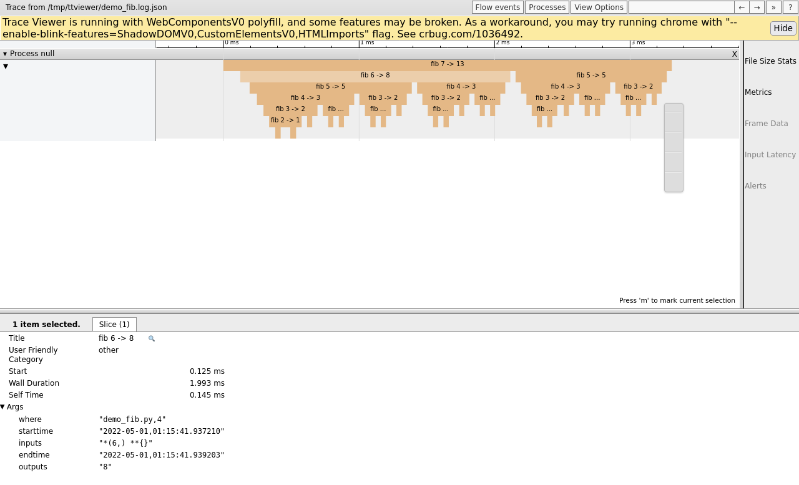

# Introduction

This module *extendedlogging* provides a layer on top of *autologging* which extends standard python *logging*.

The main purpose is to improve usability: make it *simpler* to configure tracing to file in combination with console logging.

Some extra features:
* tracing lines are by default never split over multiple lines - newlines in strings are logged as '\n'
* tracing timestamps are in microsecond resolution instead of milliseconds
* tracing lines have a configurable maximum size

# Demo

## Tracing

Given the following code:
```rb
# demo.py

import extendedlogging

# define a little example class and instrument all its functions with autologging
@extendedlogging.traced
class myclass():
    def __init__(self, *args, **kwargs):
        self.f()
        extendedlogging.debug('__init__ done')
    def f(self):
        extendedlogging.info('hi!')
        pass
    def g(self):
        return 3

# configure tracing
extendedlogging.configure(tracing=True)

# run some code to produce logging events
c = myclass('some_argument')
c.g()
extendedlogging.warning('done')


```

With the given code, the logging to stdout looks something like:
```
INFO   :f:hi!
WARNING:<module>:done
```

With the given code, the tracing to file looks something like:
```
2022-04-09 14:06:00,855471:TRACE:demo.py,6:root.__init__:CALL *('some_argument',) **{}
2022-04-09 14:06:00,855649:TRACE:demo.py,9:root.f:CALL *() **{}
2022-04-09 14:06:00,855793:INFO:demo.py,10:root.f:hi!
2022-04-09 14:06:00,855901:TRACE:demo.py,9:root.f:RETURN None
2022-04-09 14:06:00,856035:DEBUG:demo.py,8:root.__init__:__init__ done
2022-04-09 14:06:00,856065:TRACE:demo.py,6:root.__init__:RETURN None
2022-04-09 14:06:00,856093:TRACE:demo.py,12:root.g:CALL *() **{}
2022-04-09 14:06:00,856115:TRACE:demo.py,12:root.g:RETURN 3
2022-04-09 14:06:00,856161:WARNING:demo.py,21:root.<module>:done
```

For more demo's, see the code snippets in the test suite.

## Viewer

A Trace-and-Timing viewer `ttviewer` is also included, which can visualize log files.
Consider the fibonacci demo program `demo_fib.py`. 



# Testing, dependencies

* to install dependencies, run: 
  * `pip install -r REQUIREMENTS.pip`
* to run all tests locally, run: `python tests/test_extendedlogging.py`
* the `ttviewer` tooling requires `catapult` and a browser (default `google-chrome`, also `firefox` seems to work)

